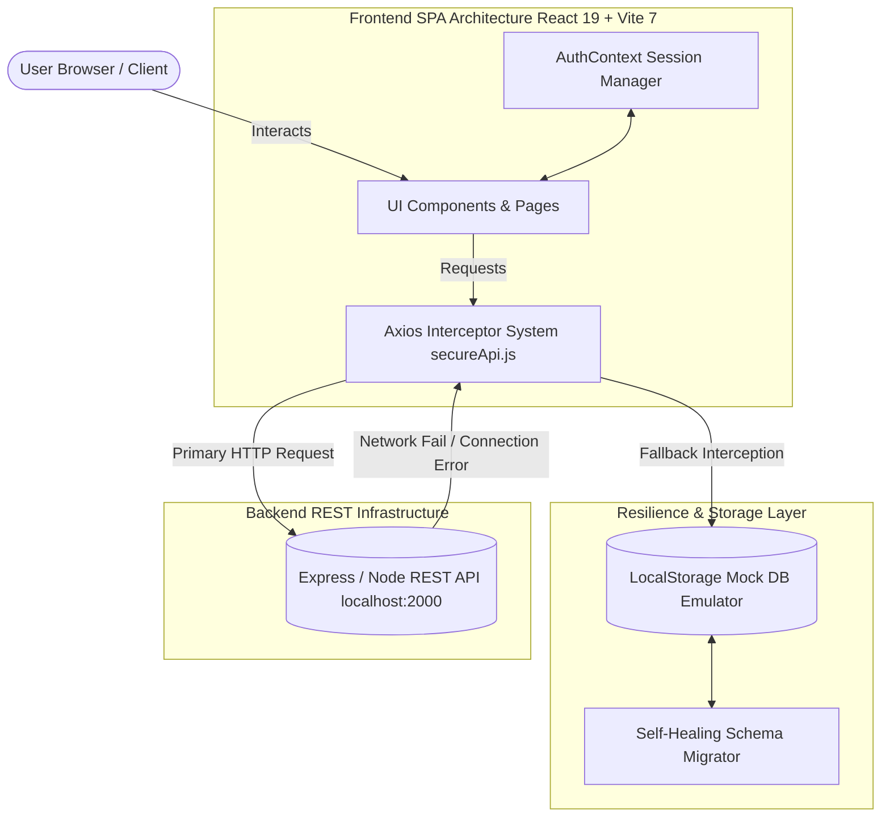

# ⚡ XDrop — Next-Gen Social Media & Content Broadcasting SPA

<p align="center">
  
  
  
  
  
  
</p>

> **XDrop** is an ultra-premium, high-performance content publishing and social media Single Page Application (SPA). Designed with senior UI/UX engineering standards, XDrop features Threads/Twitter-style social publishing, custom glassmorphism design systems, real-time fallback mock database architecture, and deep creator analytics.

---

## 📖 Table of Contents

- [📐 System Architecture Topology](#-system-architecture-topology)
- [🎯 Senior Product Engineering ADRs (Design Decisions)](#-senior-product-engineering-adrs-design-decisions)
- [✨ Core Capabilities & UX Features](#-core-capabilities--ux-features)
- [⚡ Performance & Mobile Optimizations](#-performance--mobile-optimizations)
- [🛠️ Tech Stack & Modular Architecture](#️-tech-stack--modular-architecture)
- [🛡️ Offline Self-Healing Architecture](#️-offline-self-healing-architecture)
- [🔀 Route Reference & Access Matrix](#-route-reference--access-matrix)
- [⚡ Quick Start & Setup Instructions](#-quick-start--setup-instructions)
- [⚙️ Environment Variables](#️-environment-variables)
- [🤝 Contributing & License](#-contributing--license)

---

## 📐 System Architecture Topology

The following diagram illustrates how the client application handles network requests, session state, and automatic self-healing offline interception:



---

## 🎯 Senior Product Engineering ADRs (Design Decisions)

### 📌 ADR 01: Offline-First Self-Healing Interceptor Architecture
* **Context:** Backend REST APIs (`localhost:2000`) may be offline during standalone frontend evaluation or client demonstrations.
* **Decision:** Implement dual Axios interceptors (`secureApi.js`) that catch network connection failures, automatically set `localStorage.setItem("blog_app_demo_mode", "true")`, dispatch `"connection-change"` status events, and transparently execute requests against a client-side database emulator (`mockDb.js`).
* **Consequence:** Zero downtime for reviewers or users when the backend is offline.

### 📌 ADR 02: Card-Based Focused Social Publisher over Full-Page Document Canvas
* **Context:** Heavy document editors (like Medium or Notion sheets) feel cumbersome for fast, social media-driven interactions.
* **Decision:** Build a centered social card composer (Threads/Twitter-style) with inline formatting macros, circular character limit meters, and a collapsible slide-out **"Insights"** drawer for draft management and readability scores.
* **Consequence:** Increases user publishing velocity while maintaining access to deep editorial metrics.

### 📌 ADR 03: Optimistic Follow & Likes Interaction Loop
* **Context:** Network latency can cause lag in social feedback loops (liking posts, following creators).
* **Decision:** Decouple numeric counts from heart toggle actions. Clicking numeric count triggers queries the liked users popover, while follow toggles optimistically update local component states and broadcast custom window events (`following-change`) across cards instantly.
* **Consequence:** Instant sub-50ms visual response for user actions.

---

## ✨ Core Capabilities & UX Features

### 🚀 Senior-Grade Publisher Canvas
- **Threads/Twitter-Style Publisher:** Minimalist centered post composer with integrated avatar header, public broadcast status, hashtag pills, and cover attachment previews.
- **Collapsible Insights Drawer:** Slide-out inspector containing real-time readability quality metrics (Flesch-Kincaid formula score), word counts, estimated reading time, and local drafts manager.
- **Inline Formatting Tools:** Injection macros for Bold, Italic, Blockquotes, Code blocks, and Lists.
- **Circular Progress Ring:** Dynamic SVG circular meter tracking character density in real time.

### 🤝 Social Interactions & Network Dynamics
- **Interactive Likes Popover:** Split like-toggling from count triggers. Clicking numeric counts opens a glassmorphic **"Liked by"** modal showing creator avatars, handles, professions, and direct **Follow/Unfollow** toggles.
- **Global Event Synchronization:** Follow/unfollow actions automatically update creator cards across the feed in real-time via custom browser events.
- **Interactive User Profiles:** Grid-based post display with a dynamic **Grid/List view switcher**, custom cover photo uploader (persisted in `localStorage`), and audience connection manager.

### 🎨 Premium Aesthetics & UI System
- **Forest Green & Glassmorphism Design:** Solarized-inspired color palette styled with custom CSS variables (`index.css`), smooth backdrop filters, and subtle micro-animations (`framer-motion`).
- **Background Mesh Canvas:** Floating, soft neon gradient spheres drifting in the background to add visual depth without compromising scroll performance.
- **Multi-Theme Support:** Seamless Dark/Light/System theme transitions powered by a custom `ThemeProvider`.

---

## ⚡ Performance & Mobile Optimizations

To ensure fluid 60fps animation frame rates across low-power mobile devices and high-refresh desktop displays, XDrop implements strict performance guidelines:

1. **Mobile Throttling (<768px):** Particle counts and canvas drawing loops in `ParticleBackground` and `BackgroundMesh` are dynamically scaled down on touch viewports to preserve GPU fill rate.
2. **Mouse Listener Suppression:** Touch viewports bypass cursor tracking listeners (`CustomCursor` and `GlowCard`) to prevent scroll jank and main thread repaints.
3. **Marquee Infinite Scroll:** Uses a `w-max` container with `shrink-0` copy layers to guarantee non-wrapping, hardware-accelerated translations.

---

## 🛠️ Tech Stack & Modular Architecture

```
Client/
├── public/                      # Static assets & web manifest
├── src/
│   ├── main.jsx                 # Application Entry Point
│   ├── App.jsx                  # Main App Component
│   ├── index.css                # Tailwind base + custom CSS variables & theme tokens
│   │
│   ├── routes/                  # Route Guards & Definitions
│   │   ├── AppRoutes.jsx        # Lazy-loaded route map
│   │   ├── PrivateRoute.jsx     # Authentication guard
│   │   └── PublicRoute.jsx      # Guest-only guard
│   │
│   ├── context/                 # Global Context Providers
│   │   └── AuthContext.jsx      # Auth state & user session manager
│   │
│   ├── lib/                     # Utilities & API Interceptors
│   │   ├── secureApi.js         # Primary Axios client with mock fallback interceptor
│   │   ├── api.js               # Secondary Axios client
│   │   ├── mockDb.js            # Standalone LocalStorage Database & API Route Emulator
│   │   └── utils.js             # Utility functions (`cn` class merger)
│   │
│   ├── components/              # Reusable UI Primitives & Layouts
│   │   ├── ui/                  # Shadcn primitives (button, card, dialog, input, etc.)
│   │   ├── blog/                # Blog components (PostCard.jsx)
│   │   └── layout/              # Navbar, Footer, PageTransition, BackgroundMesh
│   │
│   ├── features/                # Domain Feature Modules
│   │   ├── Auth/                # Login & Register pages
│   │   ├── Dashboard/           # Creator dashboard, CreatePost, EditPost, MyPosts
│   │   ├── Profile/             # Profile page, settings sub-pages
│   │   └── Support/             # Help & FAQ page
│   │
│   └── pages/                   # Top-level standalone pages (Home, Feed, About, Contact)
│
├── vite.config.js               # Vite bundler configuration
└── package.json                 # Project dependencies & scripts
```

---

## 🛡️ Offline Self-Healing Architecture

If you do not have the backend API server running locally on port `2000`, **XDrop automatically activates Sandbox Mode**. All creations, likes, edits, and profile updates will be safely persisted in your browser's `localStorage`.

### 🔑 Demo Login Credentials
Click the **"Autofill Demo Credentials"** button on the `/login` page or enter manually:

- **Email:** `demo@example.com`
- **Password:** `password123`

---

## 🔀 Route Reference & Access Matrix

| Route | Component | Access | Description |
| :--- | :--- | :--- | :--- |
| `/` | `Home` | Public | Landing page with animated hero, marquee, & counters |
| `/about` | `About` | Public | Manifesto and project mission |
| `/contact` | `Contact` | Public | Contact form with Zod validation |
| `/login` | `Login` | Guest Only | Login page with Sandbox Autofill |
| `/register` | `Register` | Guest Only | Account registration |
| `/feed` | `Feed` | Protected | Community blog discovery feed |
| `/post/:id` | `PostDetails` | Protected | Single post view & comment thread |
| `/dashboard` | `DashboardHome` | Protected | Analytics overview & publishing heatmaps |
| `/dashboard/create` | `CreatePost` | Protected | Threads/Twitter-style social post publisher |
| `/dashboard/posts` | `MyPosts` | Protected | Published posts manager grid |
| `/dashboard/saved` | `SavedPosts` | Protected | Bookmarked publications |
| `/dashboard/settings` | `Setting` | Protected | User account & security console |
| `/profile` | `Profile` | Protected | User profile page with grid/list post view |

---

## ⚡ Quick Start & Setup Instructions

### Prerequisites
Make sure you have Node.js (v18.x or later) and `npm` installed on your machine.

### 1. Clone the Repository
```bash
git clone https://github.com/anshul4117/Blog-client.git
cd Blog-client
```

### 2. Install Dependencies
```bash
npm install
```

### 3. Environment Configuration
Create a `.env` file in the root directory (or copy from `.env.example`):
```bash
cp .env.example .env
```
Ensure your `.env` contains:
```env
VITE_API_BASE_URL=http://localhost:2000/api/v1.2
```

### 4. Start Development Server
```bash
npm run dev
```
Open your browser and navigate to `http://localhost:5173`.

---

## ⚙️ Environment Variables

| Variable | Type | Default Value | Description |
| :--- | :--- | :--- | :--- |
| `VITE_API_BASE_URL` | String | `http://localhost:2000/api/v1.2` | Base URL for backend REST API endpoints |

---

## 📜 Available Scripts

In the project directory, you can run:

- `npm run dev`: Starts the Vite development server at `http://localhost:5173`.
- `npm run build`: Bundles the application for production into the `dist/` directory.
- `npm run preview`: Locally previews the production build output.
- `npm run lint`: Scans source code for potential linting issues.

---

## 🤝 Contributing & License

Contributions, issues, and feature requests are welcome!  
Feel free to check the [issues page](https://github.com/anshul4117/Blog-client/issues).

Distributed under the **MIT License**. See `LICENSE` for more information.

---

<p align="center">
  Designed & Built with ❤️ by <b>Anshul</b> (<a href="https://github.com/anshul4117">@anshul4117</a>)
</p>
